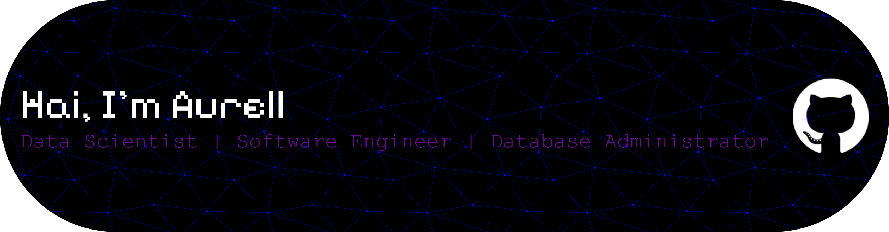

<h1 align="center">Hey, There 👋</h1>

###

I'm Aurell!!

###

  
  
  
  
  
  
  
  
  
  
  
  
  
  
  
  
  
  
  
  
  
  
  
  
  
  
  

###

  
  
  
  

###

  
  

###

<!-- <picture>
  <source media="(prefers-color-scheme: dark)" srcset="https://raw.githubusercontent.com/aurelliaputri06/aurelliaputri06/output/pacman-contribution-graph-dark.svg">
  <source media="(prefers-color-scheme: light)" srcset="https://raw.githubusercontent.com/aurelliaputri06/aurelliaputri06/output/pacman-contribution-graph.svg">
  
</picture> -->

###

###

  

###

  

###

###

<!-- 

## Hi, There! 👋 -->

<!--
**aurelliaputri06/aurelliaputri06** is a ✨ _special_ ✨ repository because its `README.md` (this file) appears on your GitHub profile.

Here are some ideas to get you started:

- 🔭 I’m currently working on ...
- 🌱 I’m currently learning ...
- 👯 I’m looking to collaborate on ...
- 🤔 I’m looking for help with ...
- 💬 Ask me about ...
- 📫 How to reach me: ...
- 😄 Pronouns: ...
- ⚡ Fun fact: ...
-->

<!-- - 🛠️ I’m currently learning [**Python**](https://www.python.org/)
- 🏹 Pronouns: she/her
- 💗

## 🌐 Socials:

# 💻 Tech Stack:

                  

# 📊 GitHub Stats:

 
 

## 🏆 GitHub Trophies

### ✍️ Random Dev Quote

### 🔝 Top Contributed Repo

---

<!-- Proudly created with GPRM ( https://gprm.itsvg.in ) -->

<!-- ##### skills

##### connect with me
 

##### my github stats
 -->

<!-- 

 -->
